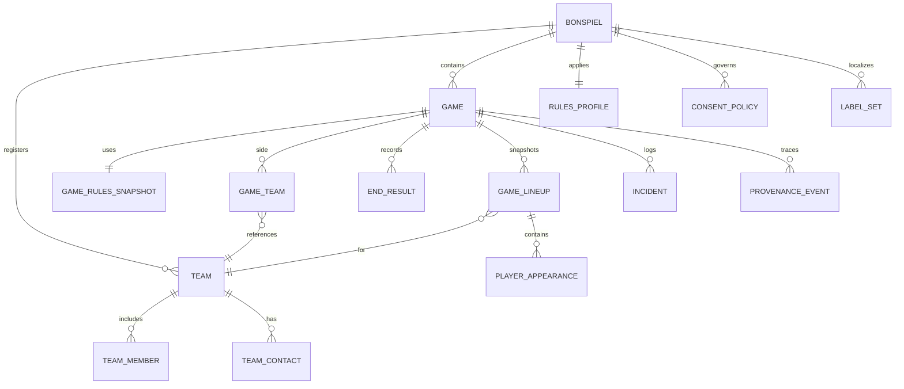
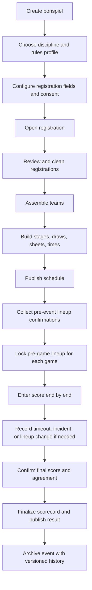
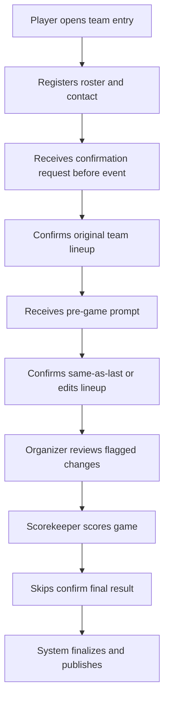

# Bonspiel Record Structure and UX for Recording Games and Rosters

## Executive summary

The reviewed curling ecosystem does **not** publish a single canonical bonspiel JSON schema. Instead, the authoritative record is split across rulebooks, lineup forms, timing and scorecard procedures, and public results products. World Curling explicitly distinguishes the **Original Team Line-up**, **Game Team Line-up**, **On-Ice Official’s Scorecard**, **Game Timing** records, and **LSD/DSC** records; Curling IO separates **registrations**, **teams**, **draw schedules**, **scores**, **spares**, and **custom fields**; CurlingZone exposes public event, game, and roster views rather than a formal data contract. That means your product should be designed around a **source-of-truth hierarchy**, not around scraping any one public UI. citeturn25view2turn29view2turn11view0turn13view1turn13view2turn19view2turn20view0

The strongest model is a layered one. At the **bonspiel level**, store explicit event identity, venue, timezone, discipline, format, registration windows, rules profile, roster policy, consent/privacy policy, multilingual labels, and version metadata. At the **game level**, store schedule and sheet metadata, team references, **per-game lineup snapshots**, total and end-by-end scores, LSFE/LSD state, timing and timeout data, incidents/penalties, and final scorecard confirmation. This is necessary because curling rules vary by discipline and sanctioning body, and even national rulebooks say general rules apply only when adopted by the governing body, while special rules take precedence. citeturn31view0turn29view2turn29view3turn30view0

For roster UX, the right pattern is **ask early, confirm later, snapshot per game**. Registration should capture the likely team entry and contact; a pre-event step should confirm the **original lineup**; a pre-game step should confirm the **game lineup** and any changes; an in-game flow should record substitutions or lineup changes as a delta, never by silently overwriting history. That mirrors how World Curling requires original lineups at the team meeting and game lineups at least **45 minutes before game time**, while Curling IO already treats registration, team assembly, and scoring as separate steps. citeturn29view2turn25view2turn13view1turn1search3turn11view0

Privacy needs to be an explicit design surface, not an afterthought. Curling IO states that registration may collect personal information such as **name, date of birth, and email**, seeks explicit consent for secondary uses, and supports required and optional waivers such as photo consent; CurlingZone’s registration and player pages show how easily roster information can become public, including player age, birthplace, residence, and team history. A modern bonspiel app should therefore default to **private-by-default PII**, separate **public roster display fields** from **internal administrative fields**, and log consent snapshots. citeturn14search1turn14search0turn18search0turn18search2turn18search3

The most important implementation choice is to store **rules and roster policy as explicit data**, not as assumptions buried in code. Mixed, mixed doubles, wheelchair, and championship play differ materially on alternates, player counts, timing, LSD/DSC, breaks, time-outs, and game length. If your schema makes those choices inspectable and versioned, the UX can be simple for users while the data remains rigorous enough for standings, disputes, and exports. citeturn24view1turn29view3turn30view0turn29view0turn29view1

## Sources and assumptions

The most useful primary and near-primary sources fell into four buckets: official rulebooks and manuals, official results products, public tournament software, and club-management software documentation. The table below shows what each source family actually contributes.

| System | Bonspiel or event fields surfaced | Game fields surfaced | Roster fields surfaced | What it implies for your schema |
|---|---|---|---|---|
| **World Curling historical results database** | Event name, venue, city, country, dates, rankings, participating teams, final linescore tables. citeturn6view0 | Final result and end-by-end summary tables for events. citeturn6view0turn7search1 | Team rosters with skip/third/second/lead/alternate and sometimes coach. citeturn6view0turn7search6 | Good public sample dataset for **archival event/game/roster** structure, but not sufficient alone for authoritative in-app operations. |
| **World Curling live scores** | Event pages with schedules, standings, sheets, live/current statistics, PDF reports, and mobile/desktop modes. citeturn8search1turn22view2 | Session dates/times, LSFE markers, extra-end markers, game-center sheet structure, shot-by-shot and PDF report hooks. citeturn22view1turn22view2turn8search1 | “Original Team Line-up” with position, function, delivery hand, alternate, coach, and in some cases age, gender, years curled, and additional officials. citeturn22view0turn22view1turn22view2 | Best public evidence for **discipline-aware roster richness** and **per-game schedule/result fields**. |
| **CurlingZone** | Event title, dates, purse, entry fee, location, contact, links, standings, playoffs. citeturn19view0 | Draw date/time, linescores by end, extra end, game details, shot tracker, head-to-head and event statistics. citeturn19view2turn20view0 | Public lineup by position in game detail pages; player pages can expose age, birthplace, residence, throw hand, team history. citeturn20view0turn18search2turn18search3 | Excellent for understanding **public-facing UX patterns**, but fields like `HMR` should not become your internal canonical names because the display abbreviations are lossy. |
| **Curling IO** | Competition name, dates, open/close dates, pricing, summary, description, skill level, required reading, sponsorship, stages, draw schedule templates, team assembly, copied-per-season event versioning. citeturn1search0turn1search2turn1search3turn10search3 | Winner/loser scoring, optional end scores, first hammer, rock colors, bracket advancement, tablet scoring access via event managers. citeturn11view0turn10search0turn10search1 | Registration fields, lineup/team name handling, spares, custom fields, waivers, profile field policies. citeturn13view1turn13view2turn13view0turn12search0turn14search0 | Best evidence for **admin UX**, **club-scale workflows**, and **prompt timing between registration, team assembly, and scoring**. |

A few assumptions are unavoidable because the reviewed sources are workflow-heavy and schema-light. I am assuming that your product should store **ISO 8601 timestamps with explicit timezone offsets**, use an **IANA timezone at the bonspiel level**, keep **stable internal property keys** distinct from translatable labels, represent end scores as a pair of integers with validation that only one side can score positively in a normal end, and treat **rule profile** as explicit data rather than implied by discipline alone. Those assumptions fit the official scoring rule that a team scores one point for each stone closer to the tee than any opposition stone, the rulebook requirement that special rules can override general rules, and the multilingual patterns described by Curling IO. citeturn28view1turn31view0turn33view0

The source hierarchy I recommend is:

| Property cluster | Primary authority | Secondary evidence |
|---|---|---|
| Event identity, dates, venue, sanction, format | Organizer entry plus sanctioning body documentation | Public event pages. citeturn19view0turn1search0turn31view0 |
| Rules, timing, ends, tiebreakers, LSFE/LSD/DSC policy | Governing-body rulebook and competition procedures | Software configuration. citeturn29view0turn29view1turn29view3turn10search2 |
| Master roster for the event | Original Team Line-up or registration record | Team profile pages. citeturn29view2turn22view1turn13view1 |
| Actual roster for a specific game | Game Team Line-up | Game detail pages. citeturn29view2turn25view2turn20view0 |
| Official game result | Agreed score plus signed scorecard | Public linescores. citeturn28view1turn26view3turn19view2 |
| Timeout, timing, delay, technical incidents | Official timing form and umpire decisions | Public result systems usually omit these. citeturn30view0turn24view4 |
| Privacy and consent | Registration system consent and waiver records | Public profile visibility settings. citeturn14search1turn14search0turn18search0 |

## Recommended record model

The core design choice is to separate **event defaults** from **game snapshots**. Event rules may say alternates are allowed, but a specific game may have a changed lineup. Event discipline may imply 8 or 10 ends, but a specific game may end early by concession or forfeit. Event labels may be bilingual, but the underlying identifiers should remain stable. That is exactly the kind of split reflected in World Curling’s original-vs-game lineup workflow and in Curling IO’s separate registrations, teams, schedules, and scores modules. citeturn29view2turn25view2turn13view1turn1search3turn11view0



The model above is the safest way to preserve event-level truth, game-level truth, and auditability at the same time. It also lets you support club bonspiels, championships, mixed doubles, and wheelchair events by swapping rule-profile values instead of forking your schema. citeturn31view0turn24view1turn29view3

### Bonspiel-level properties

The following table is the recommended **minimum serious schema** for a bonspiel record.

| Property | Required? | Type | Source | Notes | Validation |
|---|---|---:|---|---|---|
| `bonspielId` | Yes | `string` | System-generated | Use a stable UUID; never recycle across seasons. Curling IO explicitly recommends copying competitions to a new season rather than reusing them. citeturn1search0 | UUID format; immutable |
| `externalIds` | No | `object` | External systems | Map IDs for WCF, CurlingZone, club system, sanctioning body | Keys unique per provider |
| `name` | Yes | `localizedText` | Organizer | Public event title | Non-empty in default locale |
| `shortName` | No | `localizedText` | Organizer | Useful for scoreboard and mobile views | Max length, e.g. 32 chars |
| `season` | Yes | `string` | Organizer | Needed because historical retention matters and events are copied by season in club systems. citeturn1search0 | Pattern such as `2026` or `2025-26` |
| `discipline` | Yes | `enum` | Governing body or organizer | At minimum: `four_player`, `mixed`, `mixed_doubles`, `wheelchair`, `wheelchair_mixed_doubles`, `stick`, `other`; alternates and ends differ by discipline. citeturn24view1turn29view3 | Must match rules profile |
| `competitionFormat` | Yes | `object` | Organizer | Pools, round robin, bracket, page playoff, crossover, tie-breaker games | Must define at least one stage |
| `sanctioningBody` | No | `object` | Governing body | Important when federation rules apply or ranking points are awarded | If present, include `name`, `rulebookRef`, `eventClass` |
| `venue` | Yes | `object` | Organizer or venue | Include club/arena name and address. Public systems routinely expose venue and city. citeturn19view0turn6view0 | Address fields normalized |
| `timezone` | Yes | `string` | Venue | Store IANA timezone; public score products display local timezones. citeturn19view2turn22view1 | Valid IANA name |
| `startDate` | Yes | `date` | Organizer | Event start | `<= endDate` |
| `endDate` | Yes | `date` | Organizer | Event end | `>= startDate` |
| `registrationWindow` | No | `object` | Organizer | Open/close dates are first-class in Curling IO. citeturn1search0 | `openAt < closeAt` |
| `entryFee` | No | `money` | Organizer | Often public on bonspiel pages. citeturn19view0 | Currency + amount |
| `prizeStructure` | No | `object` | Organizer | Purse, prizes, ranking points; common in public event pages. citeturn19view0 | Amounts non-negative |
| `contact` | No | `object` | Organizer | Separate public contact from internal ops contact | PII access-controlled |
| `teamCapacity` | No | `object` | Organizer | Expected, minimum, maximum | Integers; `min <= max` |
| `sheets` | No | `array<string>` | Venue or organizer | Sheet labels may be alphabetical or numeric; WCF live products use Sheet A–D. citeturn22view2 | Unique labels |
| `rulesProfile` | Yes | `object` | Governing body plus organizer | Must point to the rulebook and overrides because special rules can supersede general rules. citeturn31view0 | Schema required; see below |
| `standingsPolicy` | Yes | `object` | Governing body or organizer | Rankings and tiebreakers vary; WCF uses win/loss, head-to-head, then DSC. Curling IO also exposes configurable ranking/tiebreakers. citeturn29view0turn29view1turn1search2 | Must declare method order |
| `rosterPolicy` | Yes | `object` | Governing body or organizer | Needed because alternates are allowed in some events and prohibited in others. citeturn24view1turn26view1 | Discipline-aware |
| `privacyConsentPolicy` | Yes | `object` | Organizer or registration system | Tie together waiver text, photo/video consent, public roster policy, retention; Curling IO supports waiver snapshots and optional photo consent. citeturn14search0turn14search1 | Versioned; immutable after acceptance |
| `labels` | Yes | `object` | System plus organizer | Store UI labels separately from stable keys; Curling IO distinguishes app labels from content translations. citeturn33view0 | Locale keys are BCP 47 |
| `provenance` | Yes | `object` | System | Capture `enteredBy`, `enteredAt`, `sourceKind`, `sourceRef`, `authorityLevel` | Append-only history |
| `version` | Yes | `object` | System | Event-level versioning is essential because copied seasons, roster-policy edits, and rules overrides all happen over time. citeturn1search0 | Semantic or monotonic version |

### Game-level properties

The game record should be rich enough to reconstruct the official result **and** the UX state that created it.

| Property | Required? | Type | Source | Notes | Validation |
|---|---|---:|---|---|---|
| `gameId` | Yes | `string` | System-generated | Stable UUID | UUID format |
| `bonspielId` | Yes | `string` | System | Foreign key to event | Must exist |
| `stageId` | Yes | `string` | Organizer or scheduler | Pool, draw, quarterfinal, semifinal, final, etc. | Must exist within bonspiel |
| `drawLabel` | No | `string` | Organizer or scheduler | E.g. `Draw 5`, `SF`, `TB`, `CF`; exposed in CurlingZone and WCF systems. citeturn19view2turn6view0 | Human-readable |
| `status` | Yes | `enum` | System | Recommended: `scheduled`, `ready_for_lineup`, `lineup_locked`, `in_progress`, `complete`, `finalized`, `forfeit`, `cancelled`, `postponed` | State machine only |
| `scheduledStartAt` | Yes | `datetime` | Scheduler | Public score products expose game date/time per draw or session. citeturn19view2turn22view1 | ISO 8601 with timezone |
| `actualStartAt` | No | `datetime` | Official scorer or system | Needed for delays and sync analytics | `>= scheduledStartAt - allowedEarlyStart` |
| `actualEndAt` | No | `datetime` | Official scorer or system | Supports duration metrics | `>= actualStartAt` |
| `sheet` | Yes | `string` | Scheduler or venue | Store the actual sheet label, not just seat order; official systems use named sheets. citeturn22view2 | Must be in bonspiel sheet list |
| `teamARef` | Yes | `string` | Scheduler | Reference registered team | Must exist |
| `teamBRef` | Yes | `string` | Scheduler | Reference registered team | Must exist and differ from `teamARef` |
| `stoneColorAssignment` | No | `object` | Governing body or scheduler | WCF round-robin default: first-listed team dark handles, second-listed team light. citeturn30view0 | Enum constrained |
| `lsfeOrPlacementDecision` | Yes | `object` | Official scorer or pre-game workflow | Represent explicitly as `method`, `teamId`, and supporting evidence; do **not** store a vague UI token like `HMR`. WCF uses LSD/coin toss and live products mark `*` for LSFE. citeturn30view0turn22view1turn22view2turn19view2 | Required before scoring begins |
| `scheduledEnds` | Yes | `integer` | Rules profile | WCF: 10-end and 8-end variants depend on discipline and event. citeturn29view3turn24view1 | Positive integer |
| `minEndsForOfficialResult` | Yes | `integer` | Rules profile | WCF specifies minimum completed ends for official results. citeturn29view3 | `<= scheduledEnds` |
| `completedEnds` | Yes | `integer` | Official scorer | Needed for early finishes, concessions, forfeits | Derived from `ends[]` unless overridden |
| `totals` | Yes | `object` | Official score | Aggregate scoreboard | Must equal end sum except for special `X`/incomplete logic |
| `ends` | Yes | `array<object>` | Official score | End-by-end scoring should be first-class; Curling IO supports it, CurlingZone/WCF publish it. citeturn11view0turn19view2turn6view0 | Exactly one side may score positively in a normal completed end; blank ends are `0/0` |
| `extraEndCount` | No | `integer` | Official score | Needed because public systems mark `EE` or show extra-end columns. citeturn19view2turn22view1 | Only if tied after regulation |
| `mixedDoublesOptions` | No | `object` | Official scorer | Power play, positioned stones, placement decision are discipline-specific. WCF permits one power play per team per game and not in extra ends. citeturn26view3 | Only valid for mixed doubles |
| `timeouts` | No | `object` | Timer or official score | WCF allows one 60-second team timeout per game and one per extra end. citeturn30view0 | Count limits by rules profile |
| `timing` | No | `object` | Timer | Thinking time, warnings, timing corrections, delay penalties | Use duration fields in seconds |
| `gameLineups` | Yes | `array<object>` | Game team lineup | Snapshot each side’s actual lineup for this game; World Curling requires a game lineup submission 45 minutes before game time. citeturn29view2 | Immutable snapshot after game start except delta events |
| `lineupChanges` | No | `array<object>` | Official scorer or umpire | Record outgoing/incoming player, effective end, reason, approval, re-entry status | Must satisfy roster policy |
| `incidents` | No | `array<object>` | Umpire or scorer | Concessions, forfeits, replayed ends, violations, unauthorized communication, timing decisions | Typed incident codes |
| `officials` | No | `object` | Organizer | Umpire, deputy CU, timer, statistician, scorer | IDs or names |
| `resultFlags` | Yes | `object` | Official scorer | `final`, `conceded`, `forfeited`, `replayedEnd`, `dsq`, `dnf`, etc. | Mutually consistent |
| `scoreAgreement` | Yes | `object` | Scorecard or skip confirmation | WCF says an end score is decided when the skips or vice-skips agree, and the game ends with signature on the scorecard. citeturn28view1turn26view3 | Must be captured before `finalized=true` |
| `publicMirrorRefs` | No | `object` | Public systems | Store WCF/CurlingZone URLs or IDs for traceability | No authority over official result |
| `provenance` | Yes | `object` | System | Who entered each change, from which source, when | Append-only history |
| `version` | Yes | `integer` | System | Required for sync conflict handling | Monotonic increment |

A practical provenance model for both tables is:

- `sourceKind`: `organizer_entry`, `rules_profile`, `registration`, `original_lineup_form`, `game_lineup_form`, `scorecard`, `timing_form`, `public_feed`, `manual_override`
- `sourceRef`: URL, document ID, or external ID
- `authorityLevel`: `authoritative`, `operational`, `derived`, `display_only`
- `capturedBy`, `capturedAt`, `approvedBy`

That mirrors the official distinction between lineup forms, timing forms, scorecards, and public results outputs. citeturn25view2turn26view3turn24view4

### Sample JSON Schema snippets

The following snippets encode the recommended default model. They are intentionally compact, with the expectation that production schemas would add discipline-specific conditionals, public/private field partitioning, and stricter enum registries. The constraints are grounded in the rule and product behaviors discussed above. citeturn31view0turn29view2turn29view3turn11view0turn33view0

```json
{
  "$id": "https://example.org/schema/bonspiel.json",
  "type": "object",
  "required": [
    "bonspielId",
    "name",
    "season",
    "discipline",
    "venue",
    "timezone",
    "startDate",
    "endDate",
    "competitionFormat",
    "rulesProfile",
    "rosterPolicy",
    "privacyConsentPolicy",
    "labels",
    "version"
  ],
  "properties": {
    "bonspielId": { "type": "string", "format": "uuid" },
    "name": {
      "type": "object",
      "minProperties": 1,
      "additionalProperties": { "type": "string", "minLength": 1 }
    },
    "shortName": {
      "type": "object",
      "additionalProperties": { "type": "string", "maxLength": 32 }
    },
    "season": { "type": "string", "minLength": 4 },
    "discipline": {
      "type": "string",
      "enum": [
        "four_player",
        "mixed",
        "mixed_doubles",
        "wheelchair",
        "wheelchair_mixed_doubles",
        "stick",
        "other"
      ]
    },
    "venue": {
      "type": "object",
      "required": ["name"],
      "properties": {
        "name": { "type": "string" },
        "city": { "type": "string" },
        "region": { "type": "string" },
        "country": { "type": "string" }
      }
    },
    "timezone": { "type": "string", "minLength": 1 },
    "startDate": { "type": "string", "format": "date" },
    "endDate": { "type": "string", "format": "date" },
    "competitionFormat": { "type": "object" },
    "rulesProfile": {
      "type": "object",
      "required": ["rulebookRef", "scheduledEnds", "minEndsForOfficialResult"],
      "properties": {
        "rulebookRef": { "type": "string" },
        "scheduledEnds": { "type": "integer", "minimum": 1 },
        "minEndsForOfficialResult": { "type": "integer", "minimum": 1 },
        "lsfeMethod": { "type": "string" },
        "tiebreakerMethod": { "type": "array", "items": { "type": "string" } }
      }
    },
    "rosterPolicy": {
      "type": "object",
      "required": ["maxPlayersOnIce", "allowAlternates", "allowSpares"],
      "properties": {
        "maxPlayersOnIce": { "type": "integer", "minimum": 2 },
        "allowAlternates": { "type": "boolean" },
        "allowSpares": { "type": "boolean" },
        "allowReentry": { "type": "boolean" }
      }
    },
    "privacyConsentPolicy": { "type": "object" },
    "labels": {
      "type": "object",
      "additionalProperties": {
        "type": "object",
        "additionalProperties": { "type": "string" }
      }
    },
    "version": { "type": "integer", "minimum": 1 }
  }
}
```

```json
{
  "$id": "https://example.org/schema/game.json",
  "type": "object",
  "required": [
    "gameId",
    "bonspielId",
    "stageId",
    "status",
    "scheduledStartAt",
    "sheet",
    "teamARef",
    "teamBRef",
    "lsfeOrPlacementDecision",
    "scheduledEnds",
    "completedEnds",
    "totals",
    "ends",
    "gameLineups",
    "resultFlags",
    "scoreAgreement",
    "version"
  ],
  "properties": {
    "gameId": { "type": "string", "format": "uuid" },
    "bonspielId": { "type": "string", "format": "uuid" },
    "stageId": { "type": "string" },
    "status": {
      "type": "string",
      "enum": [
        "scheduled",
        "ready_for_lineup",
        "lineup_locked",
        "in_progress",
        "complete",
        "finalized",
        "forfeit",
        "cancelled",
        "postponed"
      ]
    },
    "scheduledStartAt": { "type": "string", "format": "date-time" },
    "actualStartAt": { "type": "string", "format": "date-time" },
    "actualEndAt": { "type": "string", "format": "date-time" },
    "sheet": { "type": "string" },
    "teamARef": { "type": "string" },
    "teamBRef": { "type": "string" },
    "lsfeOrPlacementDecision": {
      "type": "object",
      "required": ["method", "teamId"],
      "properties": {
        "method": { "type": "string" },
        "teamId": { "type": "string" }
      }
    },
    "scheduledEnds": { "type": "integer", "minimum": 1 },
    "completedEnds": { "type": "integer", "minimum": 0 },
    "totals": {
      "type": "object",
      "required": ["teamA", "teamB"],
      "properties": {
        "teamA": { "type": "integer", "minimum": 0 },
        "teamB": { "type": "integer", "minimum": 0 }
      }
    },
    "ends": {
      "type": "array",
      "items": {
        "type": "object",
        "required": ["number", "teamA", "teamB"],
        "properties": {
          "number": { "type": "integer", "minimum": 1 },
          "teamA": { "type": "integer", "minimum": 0 },
          "teamB": { "type": "integer", "minimum": 0 },
          "blank": { "type": "boolean" },
          "extraEnd": { "type": "boolean" },
          "powerPlay": { "type": "boolean" }
        }
      }
    },
    "gameLineups": {
      "type": "array",
      "minItems": 2,
      "items": { "type": "object" }
    },
    "lineupChanges": {
      "type": "array",
      "items": { "type": "object" }
    },
    "timeouts": { "type": "object" },
    "timing": { "type": "object" },
    "incidents": {
      "type": "array",
      "items": { "type": "object" }
    },
    "resultFlags": {
      "type": "object",
      "properties": {
        "final": { "type": "boolean" },
        "conceded": { "type": "boolean" },
        "forfeited": { "type": "boolean" }
      }
    },
    "scoreAgreement": {
      "type": "object",
      "required": ["confirmed"],
      "properties": {
        "confirmed": { "type": "boolean" },
        "confirmedAt": { "type": "string", "format": "date-time" }
      }
    },
    "version": { "type": "integer", "minimum": 1 }
  }
}
```

## Roster capture prompts

The roster UX should mirror how curling actually works operationally. World Curling has an **original team lineup** for the event and a **game team lineup** for each game; the game lineup may confirm the original or record a change, and it must be submitted **45 minutes before game time**. Curling IO, meanwhile, already separates **registration**, **team assembly**, and **scoring**, and its documentation and product blog make clear that registration often collects the basics—team name, lineup, contact info—while additional custom questions may vary per bonspiel. citeturn29view2turn13view1turn32view0turn13view0

### Recommended prompting matrix

| When to ask | Primary prompt text | Alternate microcopy | Required fields | Defaults | Validation and UX notes |
|---|---|---|---|---|---|
| **Registration** | **Create your team entry** | “Add the players you expect to bring. You can confirm the game lineup later.” | Team name, team contact name, email, phone, player names, player count, club or affiliation if needed, waiver or consent answers | Prefill logged-in curler identity; infer event discipline from bonspiel | Good place for likely roster, not final roster. Support custom fields such as coach, first-time curler, dietary notes, or emergency contact. citeturn32view0turn13view0turn14search0 |
| **Pre-event lineup confirmation** | **Confirm your original team lineup for this event** | “This is your official event roster.” | Player names, on-ice positions, skip, vice-skip, alternates if allowed, coach or officials if tracked | Start from registration roster | Use discipline-aware validation. Mixed requires alternating genders; mixed doubles and mixed may forbid alternates; only people present at event start should appear on original lineup unless approved. citeturn24view1turn29view2 |
| **Pre-game lineup confirmation** | **Confirm today’s lineup for Draw {drawLabel} vs {opponentName}** | “Same as original lineup?” or “Any changes since your last game?” | Present players, delivery order, acting skip and vice-skip, alternate entering today, coach on bench, LSD players if applicable | One-tap “same as original” and “same as last game” | Submit or lock by deadline. World Curling requires game lineup 45 minutes before game time; CuCoS validates lineup and LSD-player correctness. citeturn29view2turn25view2 |
| **In-game substitution or lineup change** | **Record a lineup change** | “Who is leaving? Who is entering? When does this take effect?” | Outgoing player, incoming alternate or spare, effective end, reason, approval or notes | Prefill current lineup and next legal positions | Never overwrite the prior lineup snapshot. Store a delta event. In some disciplines the replaced player may not re-enter, and mixed formats have gender-order constraints. citeturn15view2turn24view1 |
| **Spare sourcing** | **Find or record a spare** | “This player is not on the registered team roster.” | Spare name, contact, eligibility basis, approval | Optional search from spare pool | Distinguish a pre-registered **alternate** from a later **spare**; Curling IO treats spares as a distinct concept. citeturn13view2turn26view1 |
| **Privacy and media consent** | **Photo and video consent** | “This is optional and won’t affect your entry.” | Accept or reject | Default to no public media consent unless explicit opt-in | Mirror Curling IO’s split between required waivers and optional acceptance. Store acceptance snapshot, timestamp, and waiver text version. citeturn14search0turn14search1 |

### Recommended prompt text variants

These are the exact text variants I would use in a first production pass, grounded in the reviewed workflows:

| Context | Prompt text |
|---|---|
| Registration headline | **Create your team entry** |
| Registration helper | “Enter the players you expect to bring. You’ll confirm the official lineup before play begins.” |
| Pre-event headline | **Confirm your original team lineup** |
| Pre-event helper | “This roster will be used as the event’s master lineup unless you submit a permitted change.” |
| Pre-game headline | **Confirm today’s lineup** |
| Pre-game helper | “Review positions, acting skip/vice-skip, and any alternate entering this game.” |
| Same-as-last CTA | **Use last game’s lineup** |
| Same-as-original CTA | **Use original lineup** |
| Substitution modal title | **Record lineup change** |
| Substitution helper | “Changes are recorded from this point forward. Earlier lineups stay unchanged.” |
| Privacy prompt | **Allow your roster to appear publicly on the scoreboard and results pages** |
| Optional media consent | **Allow photos and video from this event to be used by the organizer** |

### Validation rules that matter the most

The highest-value validations are the ones that stop illegal or confusing states before they hit the scoreboard. Those include:

| Validation | Why it matters |
|---|---|
| Do not allow more active on-ice players than the discipline permits | Mixed doubles is two players; standard team play is typically four; some club events allow three-player teams but that must be explicit. citeturn24view1turn31view0 |
| Do not allow alternates where the discipline forbids them | World Curling mixed and mixed doubles prohibit alternates; wheelchair/mixed-doubles rules also vary. citeturn24view1 |
| Enforce skip/vice-skip constraints where rules require them | Mixed requires skip and vice-skip from opposite genders. citeturn24view1 |
| Preserve lineup history per game | World Curling distinguishes original and game lineups, and changes during game must be communicated. citeturn29view2turn25view2 |
| Mark roster provenance | Distinguish registration estimate vs original lineup vs game-day confirmation vs in-game umpire-approved change. citeturn25view2 |
| Separate public roster from internal roster record | Public systems often reveal more player data than a club app should by default. citeturn18search2turn18search3turn18search0turn14search1 |

The best UX pattern for substitutions is to model three distinct things: **registered player**, **registered alternate**, and **ad hoc spare**. World Curling’s glossary defines an alternate as a registered, non-playing member eligible to substitute, while Curling IO documents spares as a separate event-level list. If you collapse those concepts into one “substitute” field, you lose the ability to validate discipline rules and you make exports and disputes materially harder. citeturn25view1turn13view2

## UX flow options

There are two viable product patterns: **organizer-controlled scoring** and **team-assisted confirmation with official lock-in**. Existing systems point in both directions. Curling IO is explicitly optimized for admins and event managers managing registrations, teams, stages, schedules, and scores, and even supports restricted scoring access for a tablet. World Curling’s public products expose both desktop and mobile modes, which is a good reminder that roster confirmation and live scoring are often done under time pressure on smaller screens. citeturn1search3turn11view0turn10search1turn22view1

### Organizer-controlled flow

This is the safest default for serious bonspiels, especially if you want auditability.



Recommended desktop organizer screens:

| Screen | Desktop emphasis | Mobile emphasis |
|---|---|---|
| Event setup | Multi-section form, stage builder, rules profile editor | Read-only summary plus quick edits |
| Team assembly | Grid/table with bulk edit, dedupe, lineup chips | Search-and-confirm, one team at a time |
| Draw schedule | Matrix by draw × sheet, drag/drop, conflict warnings | Per-draw list, filtered by sheet |
| Live scoring | End grid, lineup snapshot, incident log, scorecard summary | One game only, giant actions, large numeric keypad |

This split follows the actual strengths of reviewed systems: Curling IO’s draw scheduling is grid-centric and administrative, while public live-score products emphasize simple views, per-game summaries, and mobile switching. citeturn9search0turn10search3turn11view0turn22view1

### Team-assisted confirmation flow

This reduces organizer data entry while keeping official control where it matters.



This pattern works best if the bonspiel is large enough that organizer-only roster entry becomes a bottleneck, but not so formal that teams cannot self-confirm. It also fits what Curling IO already supports through registrations, custom fields, team recommendations, and later team assembly. citeturn13view1turn13view0turn1search3

### Onboarding, error handling, offline support, and sync

**Onboarding.** The first screen for organizers should ask only three things: discipline, format, and venue timezone. That is enough to derive most defaults. For players, the first screen should ask only whether they are entering a **team**, joining an existing team, or volunteering as a **spare**. Curling IO’s product organization—registrations, teams, scores, spares—strongly suggests that users think in those buckets naturally. citeturn13view1turn13view2turn1search3

**Error handling.** The UX should catch illegal states as early as possible: both sides scoring in one end, extra end without a tie after regulation, mixed doubles power play in an extra end, alternate entered in a discipline that forbids alternates, team lineup confirmation after the deadline, or mismatch between end totals and displayed total. These are not edge niceties; they are direct reflections of the rulebook and public scoreboard semantics. citeturn28view1turn26view3turn24view1turn29view2

**Offline support.** I did **not** find primary-source documentation of offline game-score synchronization in the reviewed curling scoring products. I did find evidence that clubs use scoring on restricted-access tablets and that Curling IO supports offline **payments**, which suggests operational tolerance for disconnected workflows but does not prove offline scoring sync. The safest recommendation is therefore an **offline-first local queue** for lineup confirmation and scoring, with conspicuous unsynced state, event/game version numbers, and conflict resolution by end number and last-write provenance. citeturn10search1turn27search1turn27search7

**Sync policy.** Use optimistic concurrency with a visible rule: if the server already has a different version of the same game, the device must reconcile instead of silently overwriting. In practice, the easiest merge policy is: roster changes merge by timestamp and effective end; scores merge only if the local editor is still editing the latest end and no other client has changed that end. If a conflict exists, show both versions and require resolve-before-finalize. That recommendation is an inference from the official importance of score agreement, timing, and lineup change tracking. citeturn28view1turn26view3turn25view2

## Property decisions and defaults

The table below lists the decisions you should make deliberately rather than leaving implicit.

| Decision | Main options | Trade-off | Recommended default | Edge cases |
|---|---|---|---|---|
| **Canonical rule reference** | Infer from discipline; explicit rulebook pointer | Inference is simpler but wrong too often | Store `rulebookRef` plus explicit overrides | Club bonspiel may follow local house rules, not WCF defaults. citeturn31view0turn29view3 |
| **Team identity** | One mutable team object; immutable team + per-game lineup snapshot | Mutable-only is simpler but destroys history | Use stable team ID plus per-game lineup snapshots | Event may keep same team but different acting skip or alternate by game. citeturn29view2 |
| **Roster capture timing** | Registration only; registration + pre-game; registration + pre-event + pre-game | Fewer prompts reduce friction but increase bad data | Registration estimate, pre-event original lineup, pre-game actual lineup | Formal championships may require stricter lock times. citeturn29view2turn32view0 |
| **Alternate vs spare** | One generic substitute; separate concepts | Generic model is easier but legally ambiguous | Model `alternate` and `spare` separately | Mixed and mixed doubles may forbid alternates entirely. citeturn24view1turn13view2 |
| **End-by-end scoring** | Winner/loser only; total score only; end-by-end | Low-detail scoring is fast but weak for auditing | Support end-by-end; allow lightweight mode only for casual events | Extra ends, concessions, and disputes are much easier with end detail. citeturn11view0turn19view2 |
| **LSFE representation** | UI token like `HMR`; explicit object | UI token is compact but semantically vague | Store explicit `method`, `teamId`, and evidence | Mixed doubles placement decisions are not exactly the same as generic hammer terminology. citeturn19view2turn22view1turn30view0 |
| **Timing depth** | No timing; totals only; structured timing events | More detail means more operational burden | Store optional structured timing object with seconds, warnings, corrections, timeouts | Needed for televised or higher-level events; optional at club level. citeturn29view3turn30view0turn24view4 |
| **Public roster display** | Publish all captured info; publish minimal info | Rich public profiles help fans but increase privacy exposure | Public by default: team name, player names, positions, affiliation only; keep DOB, email, phone, waiver data private | Junior or youth events should default to even less public detail. citeturn18search2turn18search3turn14search1turn14search0 |
| **Season versioning** | Reuse same event record; copy per season | Reuse makes trends hard and corrupts history | New bonspiel record per season, linked by series ID | Same named bonspiel recurring every year. citeturn1search0 |
| **Multilingual storage** | Translate field names; translate labels only; duplicate columns | Translating keys breaks APIs; duplicate columns do not scale | Keep stable keys, localize labels and user-entered content separately | Curling IO’s “two layers” pattern is the right precedent. citeturn33view0 |
| **Finalization trigger** | Auto-final on score entry; explicit finalize after confirmation | Auto-final is fast but risky | Require score agreement then finalize | WCF treats end score agreement and signed scorecard as distinct authoritative moments. citeturn28view1turn26view3 |
| **Tie-breaker storage** | Free-text notes only; structured standings policy | Free text is flexible but non-computable | Structured method order, plus textual override note | WCF uses win/loss, head-to-head, then DSC; club events may allow ties. citeturn29view0turn1search2 |

The practical default set I would ship first is:

1. **Stable internal English keys**
2. **Localized labels by locale**
3. **Season-scoped bonspiel IDs**
4. **Explicit rules profile**
5. **Registration roster + original lineup + game lineup**
6. **End-by-end scoring enabled by default**
7. **Per-game provenance and version numbers**
8. **Public/private field partition**
9. **Optional timing object**
10. **Offline-first sync queue with explicit resolve UI**

That default set aligns best with the official rules/processes and with the strongest existing curling software patterns, while still being implementable for a club bonspiel without Olympic-level bureaucracy. citeturn29view2turn11view0turn35search0turn33view0turn14search0

The single biggest edge-case category is **discipline drift**: standard team-play assumptions break quickly for mixed, mixed doubles, wheelchair, and championship formats. The second biggest is **public/private drift**: once player data enters public score sites or public player pages, clubs may assume those fields are supposed to be public. They are not. If you treat rules, roster, and privacy as first-class structured records, most of the remaining UX decisions become straightforward—just a matter of timing, defaults, and screen size. citeturn24view1turn29view3turn18search0turn18search3turn14search1